# SIREN 水印迁移性测试任务报告

本报告是对论文《Towards Reliable Verification of Unauthorized Data Usage in Personalized Text-to-Image Diffusion Models》（IEEE S&P 2025）的代码仓库进行的迁移性测试：在宝可梦数据集上训练出的水印编码器、解码器，能否直接迁移到另一个Q版动漫数据集(Anime-Chibi-Dataset)上使用。

## 任务一：环境配置

### 1.1 拉取 SIREN 仓库

```bash
git clone https://github.com/AntigoneRandy/SIREN.git
```

### 1.2 配置 Conda 环境


```bash
conda create --name sirentest python=3.9
conda activate sirentest
pip install -r requirements.txt
```

## 任务二：数据预处理

### 2.1 下载 Anime-Chibi 数据集并随机筛选 500 张图片

在下载目录下执行以下代码，然后将子集subset移动到代码目录下
```python
import os
import shutil
import random

# 原始数据集路径
source_dir = "./download"
# 测试子集路径
target_dir = "./subset"

os.makedirs(target_dir, exist_ok=True)

image_files = [f for f in os.listdir(source_dir) if f.endswith(('.png', '.jpg', '.jpeg'))]

selected_images = random.sample(image_files, 500)

for img in selected_images:
    shutil.copy(os.path.join(source_dir, img), target_dir)
```

### 2.2 使用 BLIP-2 生成 Caption

下载blip2-opt-2.7b到本地，运行`caption.py`使用NVIDIA GeForce RTX 4060 Laptop GPU进行半精度推理

```python
import torch
from PIL import Image
import os
from transformers import Blip2Processor, Blip2ForConditionalGeneration

model_path = "./blip2-opt-2___7b"
dataset_path = "./subset"
output_dataset_path = "./annotated_subset"

processor = Blip2Processor.from_pretrained(model_path)
model = Blip2ForConditionalGeneration.from_pretrained(
    model_path, 
    device_map="auto",
    torch_dtype=torch.float16
)

# 输出目录
os.makedirs(output_dataset_path, exist_ok=True)

for filename in os.listdir(dataset_path):
    if filename.lower().endswith(('.png', '.jpg', '.jpeg', '.bmp')):
        # 原始图像路径
        src_path = os.path.join(dataset_path, filename)
        
        # 目标路径
        base_name = os.path.splitext(filename)[0]
        dest_image_path = os.path.join(output_dataset_path, filename)
        dest_text_path = os.path.join(output_dataset_path, f"{base_name}.txt")
        
        try:
            # 复制图像到新目录
            img = Image.open(src_path).convert('RGB')
            img.save(dest_image_path)
            
            # 生成caption
            inputs = processor(
                images=img,
                return_tensors="pt"
            ).to(model.device, torch.float16)
            
            generated_ids = model.generate(**inputs, max_new_tokens=50)
            caption = processor.batch_decode(
                generated_ids,
                skip_special_tokens=True
            )[0].strip()
            
            # 保存文本标注
            with open(dest_text_path, 'w') as f:
                f.write(caption)
            
            print(f"Generated: {dest_image_path} -> {caption}")

        except Exception as e:
            print(f"Error processing {filename}: {str(e)}")
```
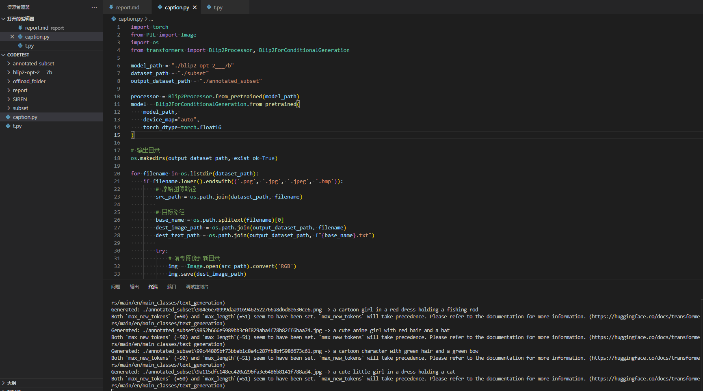

### 2.4 添加 SIREN 水印

```bash
python ./SIREN/coating.py --dataset_path "./annotated_subset" --decoder_checkpoint "./SIREN/ckpt/pokemon_decoder.pth" --encoder_checkpoint "./SIREN/ckpt/pokemon_encoder.pth" --output_path "./coated_dataset" --is_text --gpu_id 0
```

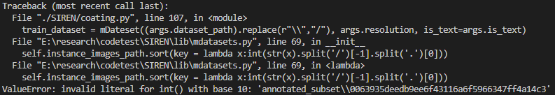

运行发现路径转换有问题，改一下代码

```python
self.instance_images_path.sort(key = lambda x:int(str(x).split('\\')[-1].split('.')[0],16))
self.instance_text_path.sort(key = lambda x:int(str(x).split('\\')[-1].split('.')[0],16))
```
运行成功
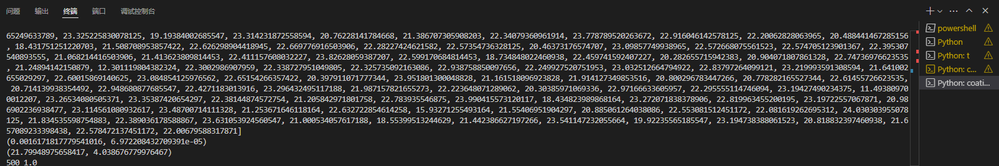
写个脚本（coated_dataset/diif.py）看看情况
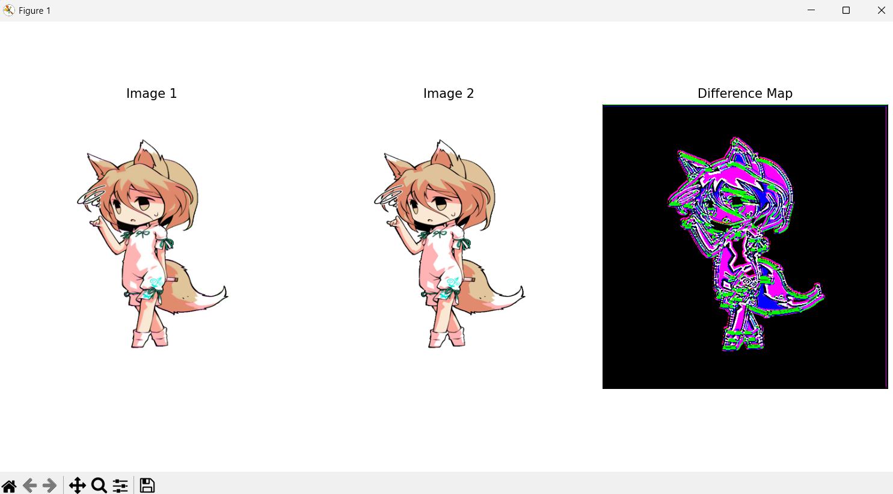
说明水印生成正确

## 任务三：训练个性化模型与生成图片

### 3.1 使用 kohya-ss LoRA 仓库训练

    训练使用NVIDIA GeForce RTX 4060 Laptop GPU，显存8G专用+8G共享=16G
    由于本实验以学习为目的，基于显存及速度考虑，调整了微调参数使显存更低速度更快
    由于显存不足，调整到了batch_size = 1并使用AdamW8bit优化器和network_dim=16
    使用kohya-ss LoRA微调10epoch，根据loss变化决定所有模型微调5epoch

下载kohya-ss LoRA 仓库保存到sd-scripts

配置clean_pokemon.toml
```toml
[general]
enable_bucket = true

[[datasets]]
resolution = 512
batch_size = 1

  [[datasets.subsets]]
  image_dir = 'coated_dataset/original'
  caption_extension = '.txt'
  num_repeats = 1
```
coated_pokemon.toml同理

运行训练命令（windous PS使用`换行，下同）
```bash
accelerate launch --gpu_ids='0'  sd-scripts/train_network.py `
    --pretrained_model_name_or_path="stable-diffusion-v1-5" `
    --dataset_config="clean.toml" `
    --output_dir="./kohya_lora_clean" `
    --output_name="kohya_lora_clean" `
    --save_model_as=safetensors `
    --prior_loss_weight=1.0 `
    --max_train_epochs=5 `
    --learning_rate=1e-4 `
    --optimizer_type="AdamW8bit" `
    --mixed_precision="no" `
    --save_every_n_epochs=10 `
    --network_module=networks.lora `
    --network_dim=16 `
    --network_alpha=8 `
    --gradient_accumulation_steps=1 `
    --cache_latents 
    
accelerate launch --gpu_ids='0'  sd-scripts/train_network.py `
    --pretrained_model_name_or_path="stable-diffusion-v1-5" `
    --dataset_config="coated.toml" `
    --output_dir="./kohya_lora_coated" `
    --output_name="kohya_lora_coated" `
    --save_model_as=safetensors `
    --prior_loss_weight=1.0 `
    --max_train_epochs=5 `
    --learning_rate=1e-4 `
    --optimizer_type="AdamW8bit" `
    --mixed_precision="fp16" `
    --save_every_n_epochs=10 `
    --network_module=networks.lora `
    --network_dim=16 `
    --network_alpha=8 `
    --gradient_accumulation_steps=1 `
    --cache_latents 
```
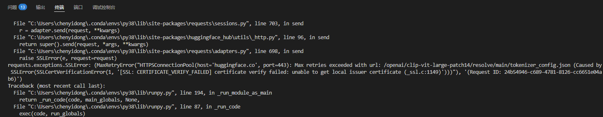
连不上huggingface，无法下载模型。手动下载模型，更改Lib\site-packages\transformers\tokenization_utils_base.py。
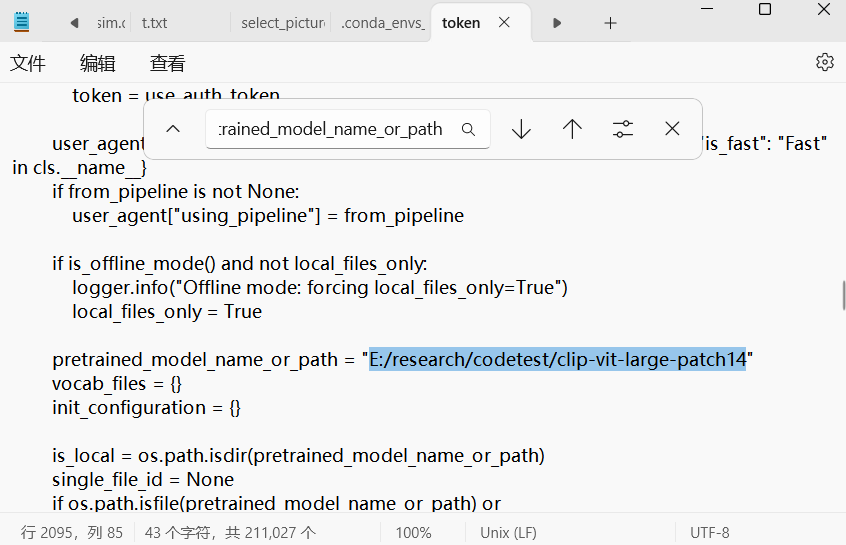
训练成功
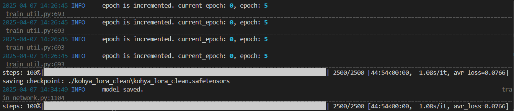


### 3.2 使用 diffusers 官方仓库训练

```bash
# 2. 训练命令
accelerate launch train_dreambooth_lora.py `
  --pretrained_model_name_or_path="stable-diffusion-v1-5" `
  --output_dir="./diffusions_lora_clean" `
  --instance_data_dir="coated_dataset/original"
  --instance_prompt="a picture of a cute anime character" `
  --resolution=512 `
  --train_batch_size=1 `
  --gradient_accumulation_steps=1 `
  --learning_rate=1e-4 `
  --num_train_epochs=5 `
  --validation_prompt="a picture of a cute anime character" `
  --validation_epochs=10 `
  --rank=16 `
  --seed=42 `
  --use_8bit_adam

accelerate launch train_dreambooth_lora.py `
  --pretrained_model_name_or_path="stable-diffusion-v1-5" `
  --output_dir="./diffusions_lora_coated" `
  --instance_data_dir="coated_dataset/coating"
  --instance_prompt="a picture of a cute anime character" `
  --resolution=512 `
  --train_batch_size=1 `
  --gradient_accumulation_steps=1 `
  --learning_rate=1e-4 `
  --num_train_epochs=5 `
  --validation_prompt="a picture of a cute anime character" `
  --validation_epochs=10 `
  --rank=16 `
  --seed=42 `
  --use_8bit_adam
```
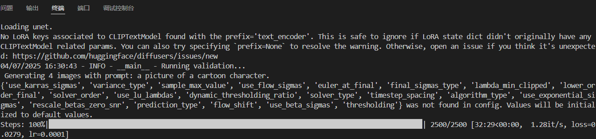

### 3.3 生成图片

运行`gen_evaluate_pic.py`用四种权重分别生成图片，命名为{modelIndex}_{promptIndex}.png
由于本实验已经引入clip，可以方便地使用clip计算图文相似度分数

```py
from diffusers import StableDiffusionPipeline
import torch
from PIL import Image
from transformers import CLIPProcessor, CLIPModel
import os
import requests

# 加载 Stable Diffusion 模型
pipe = StableDiffusionPipeline.from_pretrained(
    "stable-diffusion-v1-5",
    torch_dtype=torch.float16
).to("cuda")

# 加载 CLIP 模型和处理器
clip_model = CLIPModel.from_pretrained("openai/clip-vit-large-patch14")
clip_processor = CLIPProcessor.from_pretrained("openai/clip-vit-large-patch14")

# 定义权重文件和提示文本
weights = [
    "./kohya_lora_clean/kohya_lora_clean.safetensors",
    "./kohya_lora_coated/kohya_lora_coated.safetensors",
    "./diffusions_lora_clean/pytorch_lora_weights.safetensors",
    "./diffusions_lora_coated/pytorch_lora_weights.safetensors"
]
prompts = [
]

# 确保生成图片的目录存在
os.makedirs("gen_pic", exist_ok=True)

# 生成图片并计算图文相似度
for i in range(len(weights)):
    pipe.load_lora_weights(weights[i])
    for j in range(len(prompts)):
        # 生成图片
        image = pipe(prompts[j]).images[0]
        image_path = f"gen_pic/{i}_{j}.png"
        image.save(image_path)
        
        # 计算图文相似度
        try:
            # 加载本地图片
            image = Image.open(image_path)
            
            # 处理输入
            inputs = clip_processor(
                text=[prompts[j]],  # 使用对应的提示文本
                images=image,
                return_tensors="pt",
                padding=True
            )
            
            # 计算相似度
            outputs = clip_model(**inputs)
            logits_per_image = outputs.logits_per_image  # 图文相似度分数
            probs = logits_per_image.softmax(dim=1)      # 转换为概率
            
            print(f"Image {i}_{j}.png - Text: {prompts[j]}")
            print(f"Similarity Score: {logits_per_image.item():.4f}")
            print(f"Probability: {probs.item():.4f}\n")
            
        except Exception as e:
            print(f"Error processing image {i}_{j}.png: {e}")
```
### 3.4 方法对比
以下是针对kohya-ss与diffusers两个LoRA训练方法的实现和用法对比分析：

| 对比维度              | kohya-ss LoRA                          | diffusers LoRA                          |
|-----------------------|----------------------------------------|-----------------------------------------|
| **数据集配置方式**          | TOML文件分层配置                       | 命令行参数直接配置                      |
| **数据集定义**        | 通过`[[datasets.subsets]]`定义多数据集 | `--instance_data_dir`单路径指定     |
| **提示词控制**        | 依赖文本文件（.txt）与文件名           | `--instance_prompt`参数         |
| **LoRA层级控制**      | 通过`--network_dim`/`--network_alpha`  | 通过`--rank`参数控制               |
| **训练性能**      | 显存9G左右，运行45min  | 显存4G左右，运行35min               |

- **kohya-ss**  
  采用TOML分层配置：
  ```toml
  [[datasets.subsets]]
  image_dir = 'coated_dataset/original'  
  caption_extension = '.txt'             
  ```
  *优势*：支持多数据集混合训练
  *局限*：需要预先组织文件结构

- **diffusers**  
  完全通过命令行参数控制：
  ```bash
  --instance_data_dir="coated_dataset/original"  
  --instance_prompt="a picture of..."           
  ```
  *优势*：快速启动，适合单一概念微调  
  *局限*：缺乏多数据集支持，提示词灵活性低

以下是每张图片的CLIP结果整理，按图片编号、文本提示、相似性分数和概率进行排列：

模型对应Index
- kohya_lora_clean：0
- kohya_lora_coated：1
- diffusions_lora_clean：2
- diffusions_lora_coated：3

按模型Index分类的CLIP结果表
| 模型Index | 图片子编号 | 相似性分数  | 概率    | 人工打分(0-9) |
|-----------|------------|-------------|---------|---------|
| **0**     | 0          | 19.8164     | 1.0000  | 4  |
| **0**     | 1          | 24.4931     | 1.0000  | 3  |
| **0**     | 2          | 26.7386     | 1.0000  | 3  |
| **1**     | 0          | 27.1111     | 1.0000  | 2  |
| **1**     | 1          | 28.8642     | 1.0000  | 4  |
| **1**     | 2          | 18.9113     | 1.0000  | 3  |
| **2**     | 0          | 26.7029     | 1.0000  | 3  |
| **2**     | 1          | 29.3728     | 1.0000  | 5  |
| **2**     | 2          | 22.3227     | 1.0000  | 4  |
| **3**     | 0          | 23.7016     | 1.0000  | 2  |
| **3**     | 1          | 28.0232     | 1.0000  | 2  |
| **3**     | 2          | 23.9721     | 1.0000  | 2  |

每个模型图文相似度都很多，人工评价0，1，2号模型都差不多，3稍差。


## 任务四：测试结果

### 4.1 检测水印

再运行`gen_pics.py`每个模型生成50个图像，保存在./gen_pic/{modelIndex}文件夹下，并使用SIREN模型检测水印。

```python
# 检测干净数据集
python ./SIREN/detect.py `
    --dataset_path "./gen_pic/0" `
    --decoder_path "./SIREN/ckpt/pokemon_decoder.pth" `
    --gpu_id 0 `
    --output_path "./detection_results" `
    --output_filename "0.npy"

python ./SIREN/detect.py `
    --dataset_path "./gen_pic/2" `
    --decoder_path "./SIREN/ckpt/pokemon_decoder.pth" `
    --gpu_id 0 `
    --output_path "./detection_results" `
    --output_filename "2.npy"

# 检测加水印数据集
python ./SIREN/detect.py `
    --dataset_path "./gen_pic/1" `
    --decoder_path "./SIREN/ckpt/pokemon_decoder.pth" `
    --gpu_id 0 `
    --output_path "./detection_results" `
    --output_filename "1.npy"

python ./SIREN/detect.py `
    --dataset_path "./gen_pic/3" `
    --decoder_path "./SIREN/ckpt/pokemon_decoder.pth" `
    --gpu_id 0 `
    --output_path "./detection_results" `
    --output_filename "3.npy"
```
```log
file saved in ./detection_results/0.npy
average 19.266558294296264
variance 10.498719124301124

file saved in ./detection_results/2.npy
average 19.660686283111573
variance 8.915170050950627

file saved in ./detection_results/1.npy
average 17.062278861999513
variance 29.652935684822783

file saved in ./detection_results/3.npy
average 18.329211947917937
variance 31.769990669024267

```
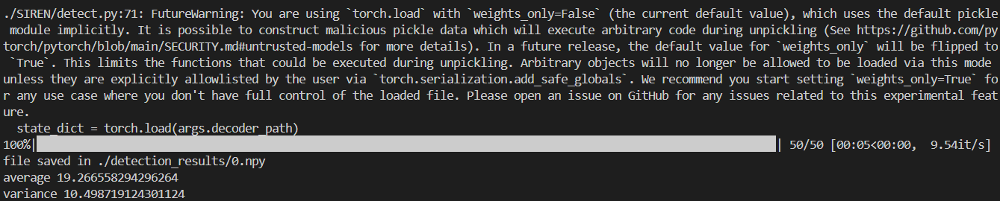


### 4.2 假设检验


```bash
python ./SIREN/ks_test.py `
    --clean_path "./detection_results/0.npy" `
    --coating_path "./detection_results/1.npy" `
    --output "./test_results/kohya.log"
    --repeat=100000
    --samples=50

python ./SIREN/ks_test.py `
    --clean_path "./detection_results/2.npy" `
    --coating_path "./detection_results/3.npy" `
    --output "./test_results/diffusers.log" 
    --repeat=100000
    --samples=50
```
运行出错
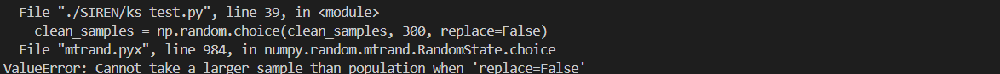
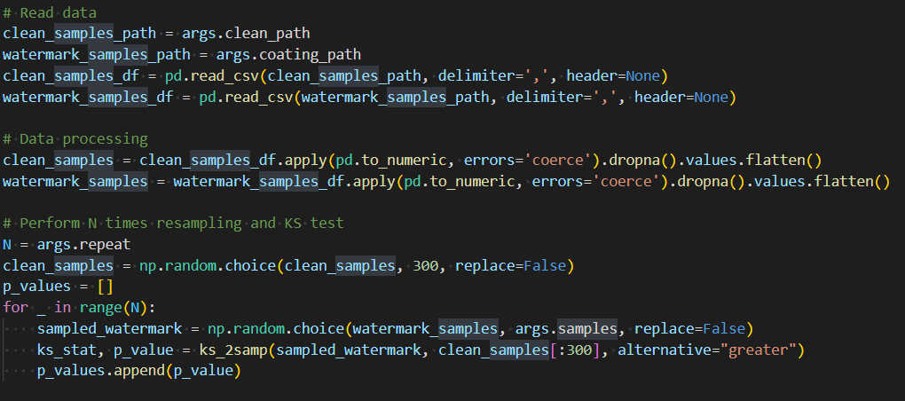

阅读代码发现`clean_samples = np.random.choice(clean_samples, 300, replace=False)`必须要取300个不同的，那就需要生成非常多的图片，那就改成replace=True允许重复取样吧。
为了方便查看进度，把repeat100000次ks_2samp的range改为trange,方便查看进度。
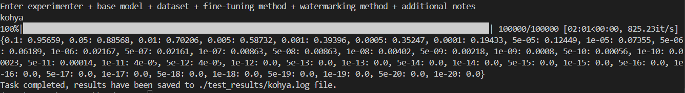

### 4.3 测试结果分析

阅读代码，易知代码的输出是p_values < threshold的频率

```log
kohya
Time: 2025-04-08 15:08
Command: python ks_test_final.py --clean_path ./detection_results/0.npy --coating_path ./detection_results/1.npy --output ./test_results/kohya.log --repeat 100000 --samples 50
Clean_sample_size: 300, Watermark_sample_size: 50
Clean statistics: (19.446927938461304, 10.978389932422981)
Watermark statistics: (17.062278861999513, 29.65293568482278)
Threshold:
{0.1: 0.95659, 0.05: 0.88568, 0.01: 0.70206, 0.005: 0.58732, 0.001: 0.39396, 0.0005: 0.35247, 0.0001: 0.19433, 5e-05: 0.12449, 1e-05: 0.07355, 5e-06: 0.06189, 1e-06: 0.02167, 5e-07: 0.02161, 1e-07: 0.00863, 5e-08: 0.00863, 1e-08: 0.00402, 5e-09: 0.00218, 1e-09: 0.0008, 5e-10: 0.00056, 1e-10: 0.00023, 5e-11: 0.00014, 1e-11: 4e-05, 5e-12: 4e-05, 1e-12: 0.0, 5e-13: 0.0, 1e-13: 0.0, 5e-14: 0.0, 1e-14: 0.0, 5e-15: 0.0, 1e-15: 0.0, 5e-16: 0.0, 1e-16: 0.0, 5e-17: 0.0, 1e-17: 0.0, 5e-18: 0.0, 1e-18: 0.0, 5e-19: 0.0, 1e-19: 0.0, 5e-20: 0.0, 1e-20: 0.0}

diffusers
Time: 2025-04-08 15:09
Command: python ks_test_final.py --clean_path ./detection_results/2.npy --coating_path ./detection_results/3.npy --output ./test_results/diffusers.log --repeat 100000 --samples 50
Clean_sample_size: 300, Watermark_sample_size: 50
Clean statistics: (19.801754382451374, 7.58085748970816)
Watermark statistics: (18.329211947917937, 31.769990669024267)
Threshold:
{0.1: 0.44682, 0.05: 0.31459, 0.01: 0.12158, 0.005: 0.07437, 0.001: 0.02254, 0.0005: 0.0193, 0.0001: 0.00396, 5e-05: 0.0036, 1e-05: 0.00073, 5e-06: 0.00059, 1e-06: 0.00024, 5e-07: 8e-05, 1e-07: 1e-05, 5e-08: 1e-05, 1e-08: 1e-05, 5e-09: 0.0, 1e-09: 0.0, 5e-10: 0.0, 1e-10: 0.0, 5e-11: 0.0, 1e-11: 0.0, 5e-12: 0.0, 1e-12: 0.0, 5e-13: 0.0, 1e-13: 0.0, 5e-14: 0.0, 1e-14: 0.0, 5e-15: 0.0, 1e-15: 0.0, 5e-16: 0.0, 1e-16: 0.0, 5e-17: 0.0, 1e-17: 0.0, 5e-18: 0.0, 1e-18: 0.0, 5e-19: 0.0, 1e-19: 0.0, 5e-20: 0.0, 1e-20: 0.0}
```
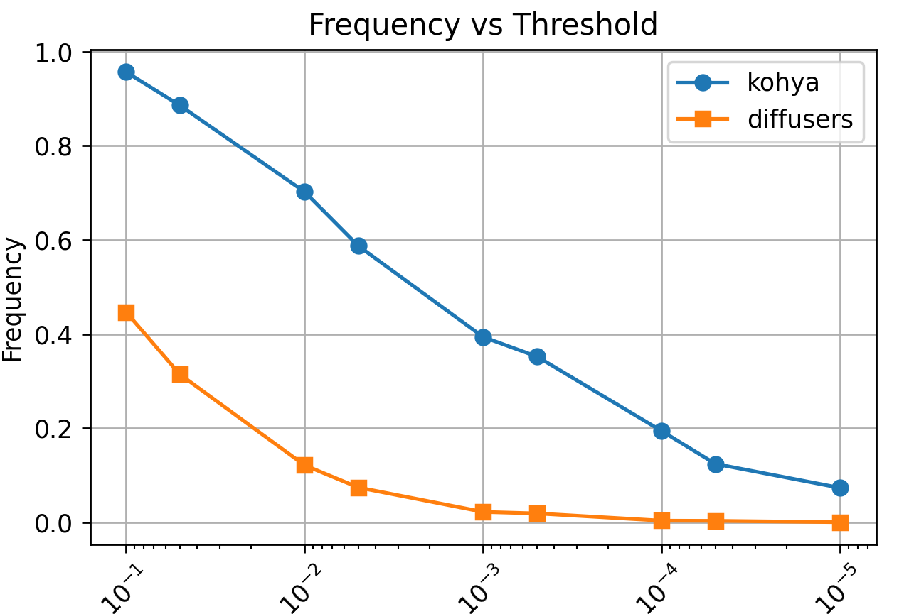

#### 数据解读
- 两次实验的干净样本大小均为 `300`，水印样本大小均为 `50`。
- **kohya**：干净样本的均值为 `19.446927938461304`，方差为 `10.978389932422981`；水印样本的均值为 `17.062278861999513`，方差为 `29.65293568482278`。
- **diffusers**：干净样本的均值为 `19.801754382451374`，方差为 `7.58085748970816`；水印样本的均值为 `18.329211947917937`，方差为 `31.769990669024267`。

可以看出，两次实验中水印样本的方差都明显大于干净样本的方差，水印样本的数据分布更为分散。

- **kohya**：在显著性水平0.05和0.01下，频率都很高（分别为0.88568和0.70206），说明分布差异显著。这表明水印嵌入对kohya_ss微调的模型输出的分布产生了显著影响。
- **diffusers**：在显著性水平0.1下，频率为0.44682，说明在44.68%的情况下，KS检验认为分布存在显著差异。
在显著性水平0.05和0.01下，频率分别为0.31459和0.12158，说明分布差异在更严格的显著性要求下不显著。
这表明水印嵌入对官方微调的模型输出的分布影响较小。

#### 结论与分析

在 `kohya` 实验中，在常见的显著性水平（如 `0.05`）下，有较高比例的检验结果拒绝原假设，说明水印样本和干净样本之间可能存在更显著的差异；而在 `diffusers` 实验中，这种差异相对不那么显著。

两次实验在不同阈值下 `p` 值小于阈值的频率差异较大，这可能是由于：
1. `diffusers` 实验中的微调模型可能欠拟合，未完全学习水印特征。
2. `diffusers` 实验中，官方实现限制了提示词唯一。而由论文可知理论原理是设计一种可靠的涂层，使其在训练中被视为与学习任务有关的特征，唯一的提示词对应多种图像及其水印，可能干扰了水印特征的学习。

因此在宝可梦数据集上训练出的水印编码器、解码器有一定的迁移性，但是可能要考虑新数据集的类似程度和模型训练的程度。

## 代码提交

所有代码已提交至 GitHub 仓库：[https://github.com/din0sauria/SIREN-codetest](https://github.com/din0sauria/SIREN-codetest)

## 运行说明

可参考本报告和README.md
